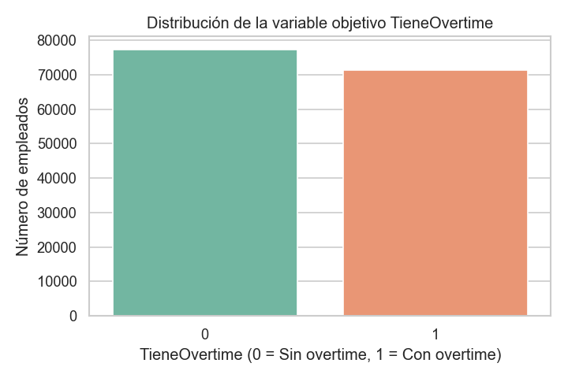
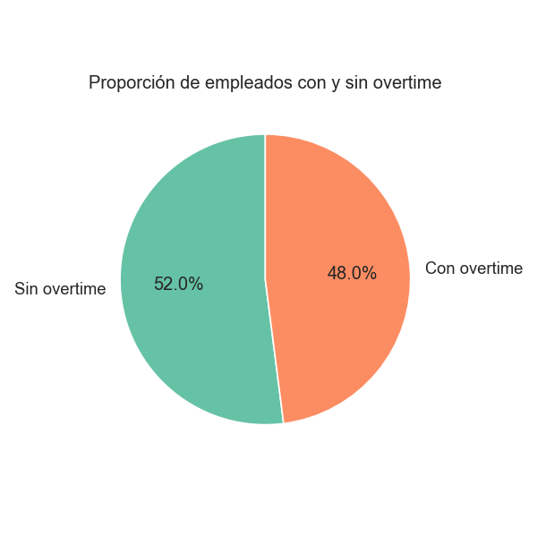
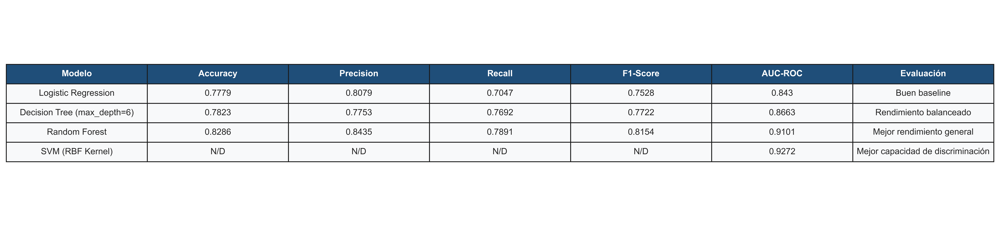
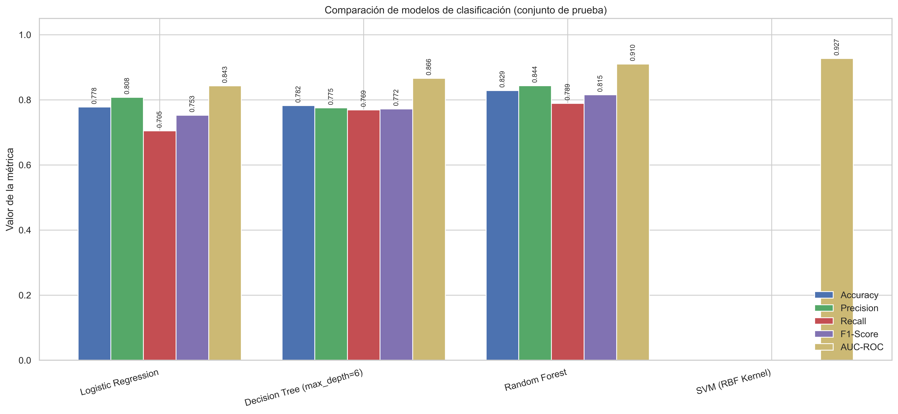
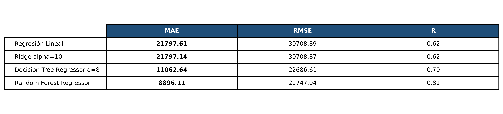
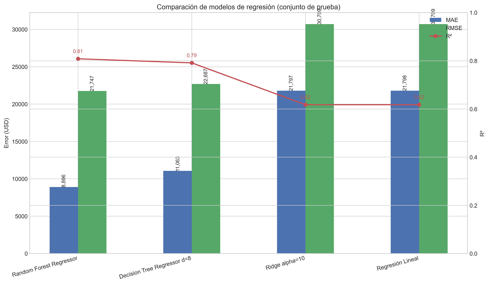
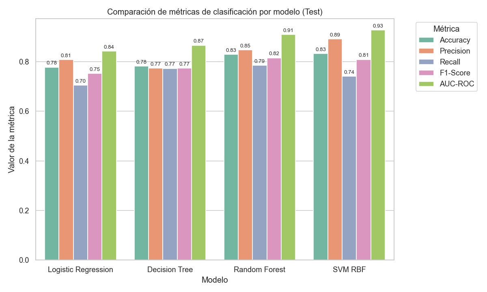

# Clasificación y regresión supervisada con el dataset San Francisco city employee salaries
<div align="justify">
  Proyecto académico de Aprendizaje Automático orientado al desarrollo, entrenamiento y comparación de modelos supervisados de clasificación y regresión aplicados a un caso técnico real: el análisis de salarios y horas extra de empleados públicos de la ciudad de San Francisco.
</div>

## Objetivo del proyecto

El objetivo de este proyecto es construir un pipeline completo de aprendizaje automático que permita:

<div align="justify">
  <ul>
    <li>
      Predecir si un empleado recibe pago por horas extra
      (<code>TieneOvertime</code>) mediante modelos de clasificación supervisada.
    </li>
    <li>
      Estimar el salario total de un empleado (<code>TotalPay</code>) mediante modelos de regresión supervisada.
    </li>
    <li>
      Comparar experimentalmente distintos modelos usando métricas apropiadas y visualizaciones claras, tal como exige la actividad.
    </li>
  </ul>
</div>

## Contexto académico

<div align="justify">
  Este trabajo fue desarrollado como parte de una actividad de Aprendizaje Automático en la que se solicita implementar al menos dos modelos supervisados sobre un dataset técnico, documentar el proceso completo en un repositorio colaborativo e incluir análisis exploratorio, preprocesamiento, comparación de rendimiento y conclusiones técnicas.
</div>
<br>
<div align="justify">
  La guía también exige presentar métricas obligatorias para clasificación, una tabla resumen con los resultados de cada modelo y visualizaciones comparativas en formato gráfico.
</div>

## Dataset

<div align="justify">
  Se utilizó el dataset **San Francisco City Employee Salaries**, que contiene información salarial de empleados públicos, incluyendo variables como salario base, pago por horas extra, otros pagos, beneficios, año y cargo laboral <code>JobTitle</code>.
</div>
<br>
<div align="justify">
  En el notebook de modelado se reporta una carga inicial de <code>**148,654 filas y 13 columnas**</code>, seguida de un proceso de limpieza y transformación que deja un conjunto listo para modelado con nuevas variables derivadas.
</div>


## Problemas abordados

### Clasificación

Se formuló un problema de clasificación binaria para responder la siguiente pregunta:

**¿El empleado recibe horas extra?**

La variable objetivo fue `TieneOvertime`, donde:

- `0` = Sin overtime
- `1` = Con overtime

### Regresión

Se formuló un problema de regresión para responder la siguiente pregunta:

**¿Cuánto gana en total un empleado?**

La variable objetivo fue `TotalPay`.

## Flujo metodológico

<div align="justify">
  El proyecto sigue un pipeline estructurado de ciencia de datos y aprendizaje automático, alineado con las etapas pedidas en la actividad.
</div>

### 1. Análisis exploratorio de datos
<div align="justify">
  Se realizó una revisión inicial del dominio del problema, de las variables disponibles y de la distribución de las clases, además de visualizaciones orientadas a comprender relaciones entre atributos y detectar valores atípicos.
</div>

### Visualizaciones del EDA — Boxplots por variable numérica
<div align="justify">
  El análisis exploratorio incluyó la descripción de variables y clases, así como visualizaciones para comprender relaciones entre atributos y detectar valores atípicos.
</div>
<br>

Entre las visualizaciones desarrolladas se incluyen:

- Matriz de correlación entre variables numéricas.
- Boxplots de variables salariales.
- Gráficos de distribución de la variable objetivo.

<br>
<br>

- Matriz de correlación entre variables numéricas:
<table>
  <tr>
    <td width="300">
      <div align="justify">
        La matriz de correlación muestra la relación lineal entre las variables
        numéricas del dataset. <code>TotalPay</code> y
        <code>TotalPayBenefits</code> presentan una correlación muy alta, dado
        que una incluye a la otra.
      </div>
    </td>
    <td>
      
    </td>
  </tr>
</table>

- Boxplots de variables salariales:

<table>
  <tr>
    <td width="300">
      <div align="justify">
        El boxplot de <code>TotalPay</code> revela una distribución fuertemente
        sesgada hacia la derecha. La mayoría de los empleados concentra su
        salario total entre <code>$36,000</code> y <code>$105,000</code>
        (rango intercuartílico), con una mediana de aproximadamente
        <code>$71,000</code>. Se identifican múltiples valores atípicos
        superiores a <code>$210,000</code>, llegando hasta
        <code>$567,000</code>, lo que indica la presencia de empleados con
        compensaciones excepcionalmente altas que justifican el tratamiento de
        <code>outliers</code> aplicado en el preprocesamiento.
      </div>
    </td>
    <td>
      
    </td>
  </tr>
</table>

<table>
  <tr>
    <td width="300">
      <div align="justify">
        El boxplot de <code>TotalPayBenefits</code> muestra la distribución del
        salario total incluyendo beneficios. La mediana se ubica cerca de
        <code>$92,000</code>, con el 50% central de los empleados entre
        <code>$44,000</code> y <code>$133,000</code>. Se observan múltiples
        valores atípicos que superan los <code>$270,000</code>, llegando hasta
        <code>$568,000</code>. Comparado con <code>TotalPay</code>, esta
        variable presenta valores consistentemente mayores, confirmando que los
        beneficios representan una parte relevante de la compensación total y
        refuerza la necesidad del tratamiento de <code>outliers</code> aplicado
        en el preprocesamiento.
      </div>
    </td>
    <td>
      
    </td>
  </tr>
</table>

<table>
  <tr>
    <td width="300">
      <div align="justify">
        Este gráfico es completamente diferente a los dos anteriores.
        <code>Year</code> no es una variable salarial sino una variable de
        tiempo discreta que solo toma 4 valores posibles:
        <code>2011</code>, <code>2012</code>, <code>2013</code> y
        <code>2014</code>. El boxplot confirma que el dataset cubre el período
        <code>2011–2014</code>. La mediana se ubica en <code>2013</code>, lo
        que indica una leve concentración de registros en los años más
        recientes. Al ser una variable temporal discreta con solo 4 valores
        posibles, no presenta <code>outliers</code> y su distribución es
        uniforme. Esta variable fue incluida como <code>feature</code> en el
        modelado para capturar posibles tendencias salariales a lo largo del
        tiempo.
      </div>
    </td>
    <td>
      
    </td>
  </tr>
</table>

<table>
  <tr>
    <td width="300">
      <div align="justify">
        La distribución es perfectamente simétrica y uniforme porque
        <code>Id</code> es simplemente una numeración consecutiva. La mediana
        coincide exactamente con la mitad del total de registros. El boxplot
        muestra una distribución uniforme y simétrica, lo cual es esperado ya
        que se trata de un identificador numérico secuencial del
        <code>1</code> al <code>148,654</code>. La mediana (~<code>74,000</code>)
        coincide con el punto central del dataset. Al no contener información
        predictiva sobre salarios ni comportamiento laboral, esta variable fue
        excluida del conjunto de <code>features</code> utilizado en el modelado.
      </div>
    </td>
    <td>
      
    </td>
  </tr>
</table>

- Gráficos de distribución de la variable objetivo:
<table>
  <tr>
    <td width="300">
      <div align="justify">
        La variable objetivo <code>TieneOvertime</code> indica si un empleado recibió
        o no pago por horas extra durante el año de registro. La distribución de
        clases es aproximadamente balanceada, con una ligera mayoría de empleados
        sin <code>overtime</code>. Esto es favorable para el entrenamiento de modelos de
        clasificación, ya que reduce el riesgo de que el modelo se sesgue en exceso
        hacia una sola clase.<br><br>
        El gráfico de barras muestra el conteo absoluto de empleados en cada clase,
        mientras que el gráfico circular resume la misma información en términos
        porcentuales, permitiendo apreciar de forma rápida la proporción relativa
        entre <code>Sin overtime</code> y <code>Con overtime</code>.
      </div>
    </td>
    <td>
      <br>
      
    </td>
  </tr>
</table>
<br>

### 2. Preprocesamiento

<div align="justify">
  El preprocesamiento incluyó varias transformaciones importantes para mejorar la calidad del dataset y preparar los modelos.
</div>
<br>
Entre las principales acciones se encuentran:

- Conversión de columnas numéricas almacenadas como texto.
- Eliminación de columnas irrelevantes como `Notes`, `Status`, `Agency` e `Id`, cuando estaban disponibles.
- Imputación de valores faltantes, incluyendo mediana global para `BasePay` y mediana por año para `Benefits`.
- Eliminación de registros con `TotalPay` negativo.
- Winsorización con IQR en variables salariales para reducir el impacto de outliers extremos.
- Creación de variables derivadas como `OvertimeRatio`, `BenefitsRatio`, `LogTotalPay` y `TieneOvertime`.
- Codificación de `JobTitle` usando agrupación de los 30 cargos más frecuentes y posterior `LabelEncoder`.
- División entrenamiento/prueba con proporción 80/20, usando estratificación en clasificación.
- Escalado de variables con `StandardScaler`, ajustado solo sobre entrenamiento para evitar data leakage.

### 3. Modelado

Se entrenaron y compararon distintos modelos supervisados tanto para clasificación como para regresión.

#### Modelos de clasificación

- Logistic Regression.
- Decision Tree Classifier.
- Random Forest Classifier.
- SVM con kernel RBF.

#### Modelos de regresión

- Regresión Lineal.
- Ridge Regression.
- Decision Tree Regressor.
- Random Forest Regressor.

## Variables utilizadas

### Features de clasificación

Para clasificación se utilizaron las siguientes variables predictoras:

- `BasePay`
- `OtherPay`
- `Benefits`
- `Year`
- `BenefitsRatio`
- `LogTotalPay`
- `JobTitleLabelEncoded`

### Variable objetivo de clasificación

- `TieneOvertime`.

### Features de regresión

Para regresión se utilizaron estas variables:

- `Benefits`
- `Year`
- `BenefitsRatio`
- `JobTitleLabelEncoded`.

### Variable objetivo de regresión

- `TotalPay`.

## Métricas de evaluación

La actividad solicita comparar modelos de clasificación con métricas obligatorias y visualizaciones específicas.

### Clasificación

Se emplearon las siguientes métricas:

- Accuracy.
- Precision.
- Recall.
- F1-Score.
- AUC-ROC.
- Matriz de confusión.

### Regresión

Para el problema de regresión se utilizaron:

- MAE.
- MSE.
- RMSE.
- \(R^2\).

## Resultados de clasificación
<table>
  <tr>
    <td width="300">
      <div align="justify">
        La tabla y el gráfico resumen el desempeño de los modelos de clasificación evaluados sobre el conjunto de prueba para predecir la variable objetivo <code>TieneOvertime</code>. En conjunto, muestran que <code>Random Forest</code> ofrece el mejor equilibrio global entre <code>Accuracy</code>, <code>Precision</code>, <code>Recall</code> y <code>F1-Score</code>, por lo que se considera el modelo más sólido para la tarea.
      </div> <br>
      <div align="justify">
         <code>Logistic Regression</code> funciona como una línea base adecuada, con resultados aceptables pero inferiores a los obtenidos por los modelos basados en árboles. <code>Decision Tree (max_depth=6)</code> presenta un comportamiento más balanceado que la regresión logística, aunque todavía queda por debajo de <code>Random Forest</code> en capacidad predictiva general.
      </div>
      </div> <br>
      <div align="justify">
         Por su parte, <code>SVM (RBF Kernel)</code> alcanza el valor más alto de <code>AUC-ROC</code>, lo que indica una excelente capacidad de discriminación entre clases. Sin embargo, dado que en esta comparación no se reportan todas las métricas principales en la tabla final, su interpretación se enfoca especialmente en esa capacidad discriminativa y no en el rendimiento global completo.
      </div>
    </td>
    <td>
        <p align="center">
          Tabla resumen de modelos de clasificación
        </p>
      
      <br>
      <br><br>
      <p align="center">
          Gráfico comparativo de métricas
        </p>
      
    </td>
  </tr>
</table>

<br>
<br>

## Resultados de modelos de regresión
<table>
  <tr>
    <td width="300">
      <div align="justify">
        En el problema de regresión se compararon varios modelos para predecir el salario total (<code>TotalPay</code>) en el conjunto de prueba, usando MAE, RMSE y R² como métricas principales.
      </div> <br>
      <div align="justify">
         La figura muestra que los modelos lineales (<code>Regresión Lineal</code> y <code>Ridge</code>) sirven como línea base, pero mantienen errores (MAE y RMSE) más altos y un R² cercano al 0.62.
      </div>
      </div> <br>
      <div align="justify">
         Los modelos basados en árboles reducen de forma importante el error y aumentan la varianza explicada:
         <code>Decision Tree Regressor d=8</code> mejora de forma notable el desempeño y el <code>Random Forest Regressor</code> alcanza el menor MAE/RMSE y el mayor R² (~0.81), por lo que se selecciona como el mejor modelo global para predecir <code>TotalPay</code>.
      </div>
    </td>
    <td>
        <p align="center">
          Tabla resumen de modelos de regresión
        </p>
      
      <br>
      <br><br>
      <p align="center">
          Gráfico comparativo de modelos de regresión
        </p>
      
    </td>
  </tr>
</table>
<br>

### Visualización comparativa de resultados
<div align="justify">
  Se cumple con el criterio de visualización comparativa de resultados mediante el uso de diversas representaciones gráficas que complementan el análisis experimental de los modelos. En particular, se incorporaron matrices de confusión para los modelos de clasificación, útiles para examinar la distribución de aciertos y errores por clase [web:572].

Asimismo, se incluyeron curvas ROC para comparar la capacidad de discriminación de los clasificadores a diferentes umbrales de decisión, lo que permite complementar la evaluación con el análisis del AUC-ROC [web:576][web:582]. De forma adicional, se elaboraron gráficos de barras comparativos para las métricas de clasificación, facilitando la interpretación conjunta de indicadores como accuracy, precision, recall y F1-score [web:577].

En el caso de regresión, también se generaron gráficos comparativos de desempeño, orientados a contrastar el comportamiento de los modelos a partir de métricas como MAE, RMSE y \(R^2\), fortaleciendo así la interpretación cuantitativa de los resultados obtenidos [web:583]. En conjunto, estas visualizaciones permiten una presentación más clara, organizada y técnicamente sustentada del rendimiento de los modelos, en línea con criterios de claridad, análisis e interpretación de resultados señalados en la rúbrica [file:586].
</div>
<br>
Entre los gráficos utilizados se incluyen:

- Matrices de confusión para los modelos de clasificación.
- Curvas ROC para comparar capacidad de discriminación.
- Barplots comparativos de métricas de clasificación.
- Gráficos comparativos de desempeño en regresión.
<br>
<div align="justify">
  De esta forma, además de la tabla resumen, el repositorio incorpora resultados visuales que facilitan la interpretación del rendimiento de cada modelo.
</div>


### Comparación de métricas por modelo de clasificación

<table>
  <tr>
    <td width="320">
      <div align="justify">
        El siguiente gráfico resume el desempeño de los cuatro modelos de
        clasificación evaluados para predecir la variable objetivo
        de <code>TieneOvertime</code> sobre el conjunto de prueba. Se muestran,
        para cada modelo, las métricas estándar de clasificación:
        de <code>Accuracy</code>, <code>Precision</code>, <code>Recall</code>,
        <code>F1-Score</code> y de <code>AUC-ROC</code>.<br><br>
        El <code>Random Forest</code> y la <code>SVM con kernel RBF</code> son
        los modelos con mejor rendimiento global, alcanzando los valores más
        altos de <code>F1-Score</code> y <code>AUC-ROC</code>. Esto indica que
        logran un buen equilibrio entre aciertos en ambas clases y capacidad de
        discriminación entre empleados con y sin overtime, superando a la
        de <code>Logistic Regression</code> y al de <code>Decision Tree</code> en la
        mayoría de las métricas.
      </div>
    </td>
    <td>
      
    </td>
  </tr>
</table>


## Detección de overfitting

<div align="justify">
  En el caso de árboles de decisión, el notebook muestra una comparación entre un árbol sin poda y un árbol controlado con <code>maxdepth=6</code>, evidenciando que el árbol sin restricción alcanza un accuracy de entrenamiento cercano a <code>**0.9999**</code> pero baja a <code>**0.8904**</code> en test, mientras que el árbol podado reduce el gap a aproximadamente <code>**0.0019**</code>.
</div>
<br>
<div align="justify">
  Este comportamiento confirma la importancia de regular la complejidad del modelo para evitar sobreajuste y mejorar la generalización.
</div>

## Hallazgos principales

- El pipeline de preprocesamiento fue determinante para asegurar calidad de datos y evitar fugas de información entre entrenamiento y prueba.
- En clasificación, **Random Forest** logró el mejor equilibrio global según F1-Score.
- En clasificación, el mejor AUC-ROC reportado en el resumen ejecutivo fue **0.9272**, lo que evidencia una alta capacidad de discriminación entre clases.
- En regresión, **Random Forest Regressor** obtuvo el mejor desempeño general con menor RMSE y mayor \(R^2\).
- Los modelos de ensamble superaron a los modelos lineales y a los árboles individuales, lo que sugiere relaciones complejas en el comportamiento salarial del dataset.
- La comparación train/test en árboles mostró claramente el riesgo de overfitting cuando no se controla la profundidad del modelo.

<div style="border:2px solid #c41e3a; border-radius:8px; padding:12px 16px; background:#1e1e1e10;">

  <p style="margin:0 0 8px 0;">
    <strong style="color:#c41e3a;">
      ✅ El mejor modelo de clasificación fue Random Forest con F1 ≈ 0.815 y AUC-ROC ≈ 0.91,
      y el mejor modelo de regresión fue Random Forest Regressor con R² ≈ 0.81.
    </strong>
  </p>

  <p style="margin:0;">
    <strong style="color:#007acc;">
      🔍 El pipeline de preprocesamiento fue determinante para asegurar calidad de datos
      y evitar fugas de información entre entrenamiento y prueba.
    </strong>
  </p>

</div>

## Conclusiones técnicas

<div align="justify">
  Este proyecto demuestra que un enfoque de pipeline completo —desde limpieza
  de datos hasta comparación experimental— permite construir soluciones
  supervisadas sólidas sobre datos reales, tal como solicita la actividad
  académica.
</div>

<br>

<div align="justify">
  Para clasificación, el modelo recomendado es <strong>Random Forest</strong>,
  ya que ofrece el mejor balance entre precisión y recall, reflejado en su
  F1-Score superior.
</div>

<br>

<div align="justify">
  Para regresión, el modelo recomendado es
  <strong>Random Forest Regressor</strong>, debido a su mejor capacidad
  predictiva y a su menor error en comparación con los modelos lineales y con
  el árbol de decisión individual.
</div>

<br>

<div align="justify">
  En términos metodológicos, el trabajo también refuerza varias lecciones
  importantes: comenzar con un baseline, comparar train y test para detectar
  sobreajuste, usar métricas correctas según el problema y evitar el uso del
  conjunto de prueba durante cualquier etapa de ajuste.
</div>

## Estructura del repositorio

Una organización recomendada para este proyecto es la siguiente:

```text
desarrollo/
│── .gitignore
│── README.md
│── requirements.txt
│
├── data/
│   ├── raw/
│   │   └── dataset_original.csv
│   └── processed/
│       └── dataset_limpio.csv
│
├── notebooks/
│   ├── 01_eda.ipynb
│   ├── 02_preprocesamiento.ipynb
│   ├── 03_modelado.ipynb
│   ├── 04_evaluacion.ipynb
│   └── 04_regresion_evaluacion.ipynb
│
├── reports/
│   ├── resultados_clasificacion.csv
│   └── figures/
│       ├── barplot_metricas_modelos.png
│       ├── cm_decision_tree_(max_depth=6).png
│       ├── cm_logistic_regression.png
│       ├── cm_random_forest.png
│       ├── cm_svm_(rbf,_20%_train).png
│       ├── eda_boxplot_Id.png
│       ├── eda_boxplot_TotalPay.png
│       ├── eda_boxplot_TotalPayBenefits.png
│       ├── eda_boxplot_Year.png
│       ├── eda_distribucion_TieneOvertime.png
│       ├── eda_matriz_correlacion.png
│       ├── eda_proporcion_TieneOvertime.png
│       ├── evaluacion_barplot_metricas_clasificacion.png
│       └── modelos_regresion_comparacion.png
│
└── src/
```

## Tecnologías y librerías utilizadas

- Python.
- pandas.
- NumPy.
- matplotlib.
- seaborn.
- scikit-learn.

## Cómo ejecutar el proyecto

1. Clonar el repositorio.
2. Ubicar el dataset `dataset_original.csv` dentro de la carpeta `data/`.
3. Abrir los notebooks en el orden recomendado:
   - `01_eda.ipynb`
   - `02_preprocesamiento.ipynb`
   - `03_modelado.ipynb`
   - `04_evaluacion.ipynb`
4. Ejecutar todas las celdas para reproducir el pipeline completo, las métricas y las visualizaciones.

## Recomendaciones de mejora futura

- Incorporar validación cruzada de forma más sistemática en todos los modelos.
- Realizar ajuste fino de hiperparámetros para SVM y Random Forest con `GridSearchCV`.
- Mejorar la interpretabilidad del modelo final mediante importancia de variables y análisis SHAP o permutation importance.
- Exportar automáticamente tablas y gráficos a la carpeta `reports/` para facilitar la entrega final.

## Autores

- Daniel Fernando Salgado Santamaría.
- Jairo Wladimir Jhayya Perlaza.
- Luis Gabriel Salgado Santamaría.
- Oscar Paul Naranjo Castro.
