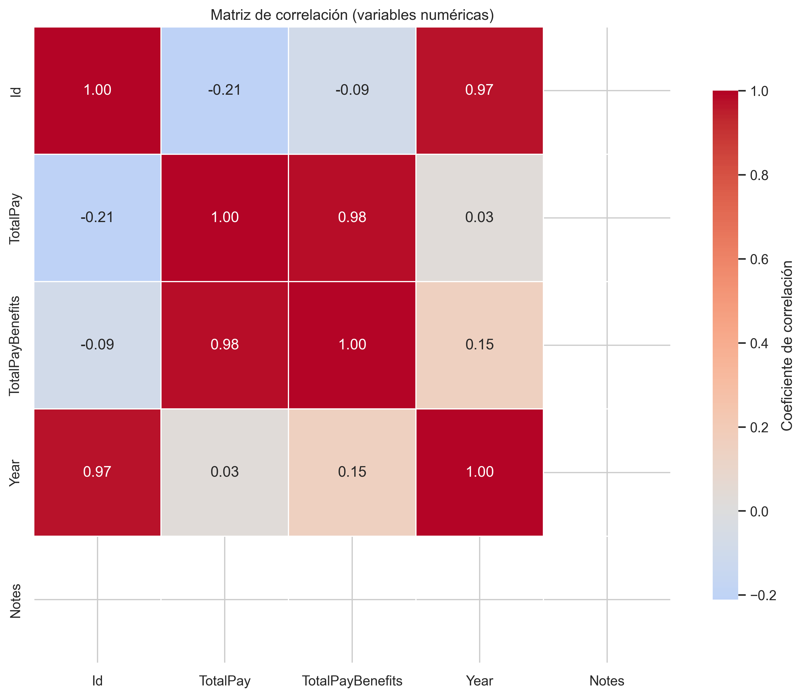
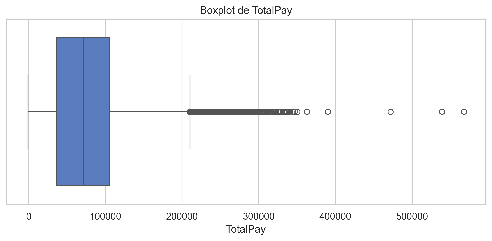
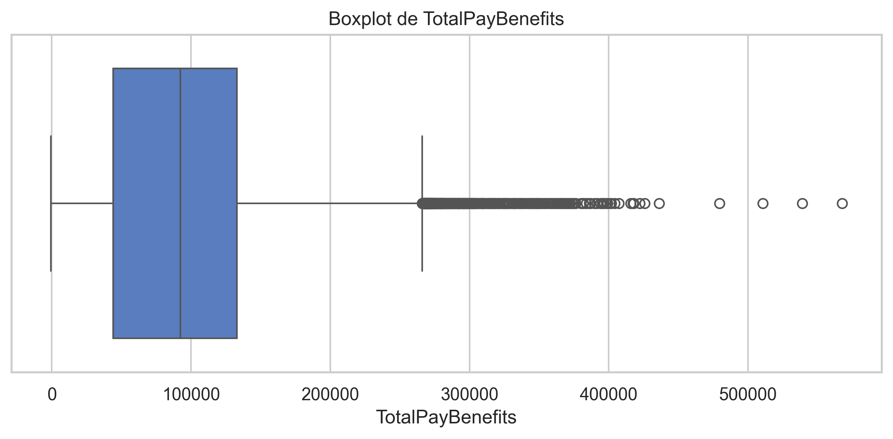
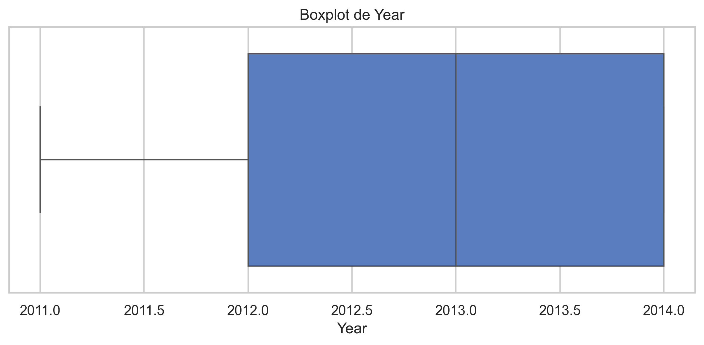
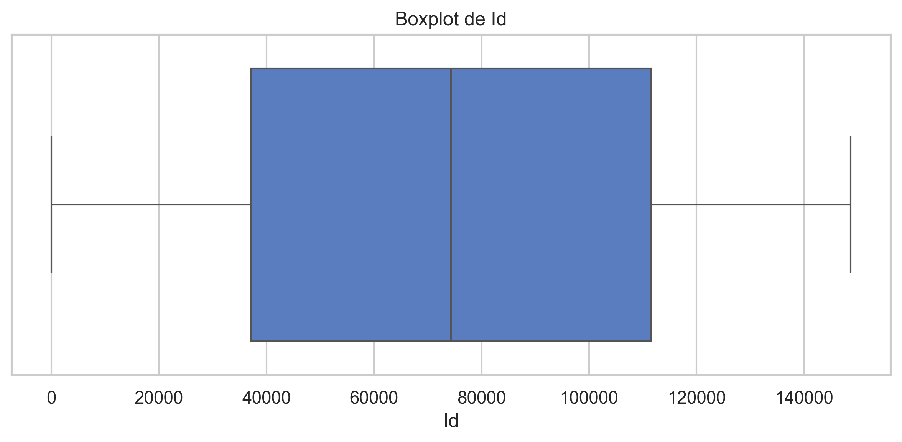

# Clasificación y Regresión Supervisada con el dataset San Francisco City Employee Salaries

Proyecto académico de Aprendizaje Automático orientado al desarrollo, entrenamiento y comparación de modelos supervisados de clasificación y regresión aplicados a un caso técnico real: el análisis de salarios y horas extra de empleados públicos de la ciudad de San Francisco.

## Objetivo del proyecto

El objetivo de este proyecto es construir un pipeline completo de aprendizaje automático que permita:

- Predecir si un empleado recibe pago por horas extra (`TieneOvertime`) mediante modelos de clasificación supervisada.
- Estimar el salario total de un empleado (`TotalPay`) mediante modelos de regresión supervisada.
- Comparar experimentalmente distintos modelos usando métricas apropiadas y visualizaciones claras, tal como exige la actividad.

## Contexto académico

Este trabajo fue desarrollado como parte de una actividad de Aprendizaje Automático en la que se solicita implementar al menos dos modelos supervisados sobre un dataset técnico, documentar el proceso completo en un repositorio colaborativo e incluir análisis exploratorio, preprocesamiento, comparación de rendimiento y conclusiones técnicas.

La guía también exige presentar métricas obligatorias para clasificación, una tabla resumen con los resultados de cada modelo y visualizaciones comparativas en formato gráfico.

## Dataset

Se utilizó el dataset **San Francisco City Employee Salaries**, que contiene información salarial de empleados públicos, incluyendo variables como salario base, pago por horas extra, otros pagos, beneficios, año y cargo laboral (`JobTitle`).

En el notebook de modelado se reporta una carga inicial de **148,654 filas y 13 columnas**, seguida de un proceso de limpieza y transformación que deja un conjunto listo para modelado con nuevas variables derivadas.

## Problemas abordados

### Clasificación

Se formuló un problema de clasificación binaria para responder la siguiente pregunta:

**¿El empleado recibe horas extra?**

La variable objetivo fue `TieneOvertime`, donde:

- `0` = Sin overtime
- `1` = Con overtime

### Regresión

Se formuló un problema de regresión para responder la siguiente pregunta:

**¿Cuánto gana en total un empleado?**

La variable objetivo fue `TotalPay`.

## Flujo metodológico

El proyecto sigue un pipeline estructurado de ciencia de datos y aprendizaje automático, alineado con las etapas pedidas en la actividad.

### 1. Análisis exploratorio de datos

Se realizó una revisión inicial del dominio del problema, de las variables disponibles y de la distribución de las clases, además de visualizaciones orientadas a comprender relaciones entre atributos y detectar valores atípicos.

### Visualizaciones del EDA — Boxplots por variable numérica

El análisis exploratorio incluyó la descripción de variables y clases, así como visualizaciones para comprender relaciones entre atributos y detectar valores atípicos.

Entre las visualizaciones desarrolladas se incluyen:

- Matriz de correlación entre variables numéricas.

| Descripción | Gráfico |
|---|---|
| La matriz de correlación muestra la relación lineal entre las variables numéricas del dataset. `TotalPay` y `TotalPayBenefits` presentan correlación muy alta dado que una incluye a la otra. |  |

- Boxplots de variables salariales.

| Variable | Distribución |
|---|---|
| TotalPay El boxplot de `TotalPay` revela una distribución fuertemente sesgada hacia la derecha. La mayoría de los empleados concentra su salario total entre $36,000 y $105,000 (rango intercuartílico), con una mediana de aproximadamente $71,000. Se identifican múltiples valores atípicos superiores a $210,000, llegando hasta $567,000, lo que indica la presencia de empleados con compensaciones excepcionalmente altas que justifican el tratamiento de outliers aplicado en el preprocesamiento. |  |


| Variable | Distribución |
|---|---|
| TotalPayBenefits |  |
| Year |  |
| Id |  |

- Gráficos de distribución de la variable objetivo.


- Visualizaciones de apoyo para identificar patrones y comportamiento de los datos.


### 2. Preprocesamiento

El preprocesamiento incluyó varias transformaciones importantes para mejorar la calidad del dataset y preparar los modelos.

Entre las principales acciones se encuentran:

- Conversión de columnas numéricas almacenadas como texto.
- Eliminación de columnas irrelevantes como `Notes`, `Status`, `Agency` e `Id`, cuando estaban disponibles.
- Imputación de valores faltantes, incluyendo mediana global para `BasePay` y mediana por año para `Benefits`.
- Eliminación de registros con `TotalPay` negativo.
- Winsorización con IQR en variables salariales para reducir el impacto de outliers extremos.
- Creación de variables derivadas como `OvertimeRatio`, `BenefitsRatio`, `LogTotalPay` y `TieneOvertime`.
- Codificación de `JobTitle` usando agrupación de los 30 cargos más frecuentes y posterior `LabelEncoder`.
- División entrenamiento/prueba con proporción 80/20, usando estratificación en clasificación.
- Escalado de variables con `StandardScaler`, ajustado solo sobre entrenamiento para evitar data leakage.

### 3. Modelado

Se entrenaron y compararon distintos modelos supervisados tanto para clasificación como para regresión.

#### Modelos de clasificación

- Logistic Regression.
- Decision Tree Classifier.
- Random Forest Classifier.
- SVM con kernel RBF.

#### Modelos de regresión

- Regresión Lineal.
- Ridge Regression.
- Decision Tree Regressor.
- Random Forest Regressor.

## Variables utilizadas

### Features de clasificación

Para clasificación se utilizaron las siguientes variables predictoras:

- `BasePay`
- `OtherPay`
- `Benefits`
- `Year`
- `BenefitsRatio`
- `LogTotalPay`
- `JobTitleLabelEncoded`

### Variable objetivo de clasificación

- `TieneOvertime`.

### Features de regresión

Para regresión se utilizaron estas variables:

- `Benefits`
- `Year`
- `BenefitsRatio`
- `JobTitleLabelEncoded`.

### Variable objetivo de regresión

- `TotalPay`.

## Métricas de evaluación

La actividad solicita comparar modelos de clasificación con métricas obligatorias y visualizaciones específicas.

### Clasificación

Se emplearon las siguientes métricas:

- Accuracy.
- Precision.
- Recall.
- F1-Score.
- AUC-ROC.
- Matriz de confusión.

### Regresión

Para el problema de regresión se utilizaron:

- MAE.
- MSE.
- RMSE.
- \(R^2\).

## Resultados de clasificación

A continuación se presenta la tabla resumen de modelos de clasificación sobre el conjunto de prueba, cumpliendo con lo solicitado en la actividad.

| Modelo                        | Accuracy ↑ | Precision ↑ |   Recall ↑ | F1-Score ↑ |  AUC-ROC ↑ | Evaluación                           |
| ----------------------------- | ---------: | ----------: | ---------: | ---------: | ---------: | ------------------------------------ |
| Logistic Regression           |     0.7779 |      0.8079 |     0.7047 |     0.7528 |     0.8430 | Buen baseline                        |
| Decision Tree (max_depth = 6) |     0.7823 |      0.7753 |     0.7692 |     0.7722 |     0.8663 | Balanceado                           |
| Random Forest                 | **0.8286** |  **0.8435** | **0.7891** | **0.8154** |     0.9101 | 🏆 Mejor rendimiento general         |
| **SVM (RBF Kernel)**          |        N/D |         N/D |        N/D |        N/D | **0.9272** | 🔥 Mejor capacidad de discriminación |


### Interpretación de clasificación

Los resultados muestran que **Random Forest** fue el mejor modelo en términos de **F1-Score**, alcanzando **0.8154**, lo que lo convierte en la mejor opción cuando se busca equilibrio entre precisión y recall.

Además, el resumen ejecutivo del notebook reporta que el mejor **AUC-ROC global** fue **0.9272**, asociado al mejor comportamiento discriminativo entre clases.

Por tanto, desde una perspectiva práctica, **Random Forest** se selecciona como el modelo principal de clasificación por su desempeño robusto y balanceado, mientras que **SVM RBF** destaca como una alternativa fuerte en capacidad de separación entre clases.

## Resultados de regresión

La comparación de modelos de regresión sobre el conjunto de prueba fue la siguiente:

| Modelo                                  | MAE ↓ (Error Absoluto Medio) | RMSE ↓ (Raíz del Error Cuadrático) | R² ↑ (Coeficiente de Determinación) | Evaluación            |
| --------------------------------------- | ---------------------------: | ---------------------------------: | ----------------------------------: | --------------------- |
| Regresión Lineal                        |                    21,797.61 |                          30,708.89 |                               0.618 | Base (bajo desempeño) |
| Ridge (α = 10)                          |                    21,797.14 |                          30,708.87 |                               0.618 | Similar a Lineal      |
| Decision Tree Regressor (max_depth = 8) |                    11,062.64 |                          22,686.61 |                               0.791 | Mejora significativa  |
| **Random Forest Regressor**             |                 **8,896.11** |                      **21,747.04** |                           **0.808** | 🏆 Mejor modelo       |


### Interpretación de regresión

El mejor modelo de regresión fue **Random Forest Regressor**, con un **RMSE de 21,747.04** y un \(R^2\) de **0.8083**, lo que indica una mayor capacidad explicativa frente a los modelos lineales y frente al árbol individual.

Esto sugiere que las relaciones entre las variables salariales y el salario total presentan componentes no lineales que son capturados mejor por modelos de ensamble.

### Visualización comparativa de resultados

La comparación experimental de los modelos se complementó con visualizaciones en formato gráfico, tal como solicita la actividad.

Entre los gráficos utilizados se incluyen:

- Matrices de confusión para los modelos de clasificación.
- Curvas ROC para comparar capacidad de discriminación.
- Barplots comparativos de métricas de clasificación.
- Gráficos comparativos de desempeño en regresión.

De esta forma, además de la tabla resumen, el repositorio incorpora resultados visuales que facilitan la interpretación del rendimiento de cada modelo.

## Detección de overfitting

En el caso de árboles de decisión, el notebook muestra una comparación entre un árbol sin poda y un árbol controlado con `maxdepth=6`, evidenciando que el árbol sin restricción alcanza un accuracy de entrenamiento cercano a **0.9999** pero baja a **0.8904** en test, mientras que el árbol podado reduce el gap a aproximadamente **0.0019**.

Este comportamiento confirma la importancia de regular la complejidad del modelo para evitar sobreajuste y mejorar la generalización.

## Hallazgos principales

- El pipeline de preprocesamiento fue determinante para asegurar calidad de datos y evitar fugas de información entre entrenamiento y prueba.
- En clasificación, **Random Forest** logró el mejor equilibrio global según F1-Score.
- En clasificación, el mejor AUC-ROC reportado en el resumen ejecutivo fue **0.9272**, lo que evidencia una alta capacidad de discriminación entre clases.
- En regresión, **Random Forest Regressor** obtuvo el mejor desempeño general con menor RMSE y mayor \(R^2\).
- Los modelos de ensamble superaron a los modelos lineales y a los árboles individuales, lo que sugiere relaciones complejas en el comportamiento salarial del dataset.
- La comparación train/test en árboles mostró claramente el riesgo de overfitting cuando no se controla la profundidad del modelo.

<div style="border:2px solid #c41e3a; border-radius:8px; padding:12px 16px; background:#1e1e1e10;">

  <p style="margin:0 0 8px 0;">
    <strong style="color:#c41e3a;">
      ✅ El mejor modelo de clasificación fue Random Forest con F1 ≈ 0.815 y AUC-ROC ≈ 0.91,
      y el mejor modelo de regresión fue Random Forest Regressor con R² ≈ 0.81.
    </strong>
  </p>

  <p style="margin:0;">
    <strong style="color:#007acc;">
      🔍 El pipeline de preprocesamiento fue determinante para asegurar calidad de datos
      y evitar fugas de información entre entrenamiento y prueba.
    </strong>
  </p>

</div>

## Conclusiones técnicas

Este proyecto demuestra que un enfoque de pipeline completo —desde limpieza de datos hasta comparación experimental— permite construir soluciones supervisadas sólidas sobre datos reales, tal como solicita la actividad académica.

Para clasificación, el modelo recomendado es **Random Forest**, ya que ofrece el mejor balance entre precisión y recall, reflejado en su F1-Score superior.

Para regresión, el modelo recomendado es **Random Forest Regressor**, debido a su mejor capacidad predictiva y a su menor error en comparación con los modelos lineales y con el árbol de decisión individual.

En términos metodológicos, el trabajo también refuerza varias lecciones importantes: comenzar con un baseline, comparar train y test para detectar sobreajuste, usar métricas correctas según el problema y evitar el uso del conjunto de prueba durante cualquier etapa de ajuste.

## Estructura del repositorio

Una organización recomendada para este proyecto es la siguiente:

```bash
proyecto-ml-salaries/
│
├── README.md
├── data/
│   └── dataset_original.csv
├── notebooks/
│   ├── 01_eda.ipynb
│   ├── 02_preprocesamiento.ipynb
│   ├── 03_modelado.ipynb
│   └── 04_evaluacion.ipynb
├── reports/
│   ├── resultados_clasificacion.csv
│   ├── resultados_regresion.csv
│   ├── matriz_confusion.png
│   ├── comparacion_clasificacion.png
│   └── comparacion_regresion.png
└── src/
    └── utilidades.py
```

## Tecnologías y librerías utilizadas

- Python.
- pandas.
- NumPy.
- matplotlib.
- seaborn.
- scikit-learn.

## Cómo ejecutar el proyecto

1. Clonar el repositorio.
2. Ubicar el dataset `dataset_original.csv` dentro de la carpeta `data/`.
3. Abrir los notebooks en el orden recomendado:
   - `01_eda.ipynb`
   - `02_preprocesamiento.ipynb`
   - `03_modelado.ipynb`
   - `04_evaluacion.ipynb`
4. Ejecutar todas las celdas para reproducir el pipeline completo, las métricas y las visualizaciones.

## Recomendaciones de mejora futura

- Incorporar validación cruzada de forma más sistemática en todos los modelos.
- Realizar ajuste fino de hiperparámetros para SVM y Random Forest con `GridSearchCV`.
- Mejorar la interpretabilidad del modelo final mediante importancia de variables y análisis SHAP o permutation importance.
- Exportar automáticamente tablas y gráficos a la carpeta `reports/` para facilitar la entrega final.

## Autores

- Daniel Fernando Salgado Santamaría.
- Jairo Wladimir Jhayya Perlaza.
- Luis Gabriel Salgado Santamaría.
- Oscar Paul Naranjo Castro.
